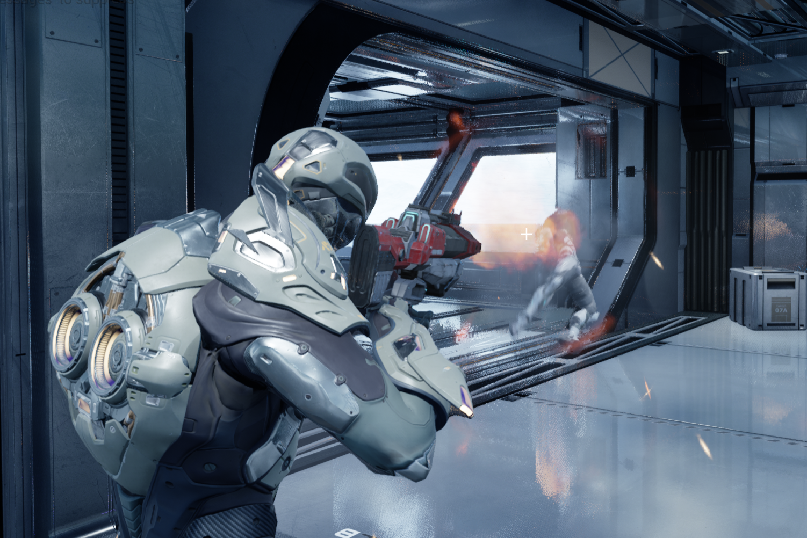

# Simple FPS

A simple C++ fps game created in UE4. One level, character animations with blend space, basic AI behavior tree, swappable weapons, simple HUD.

All the C++ code I've written is inside Source/SimpleShooter

